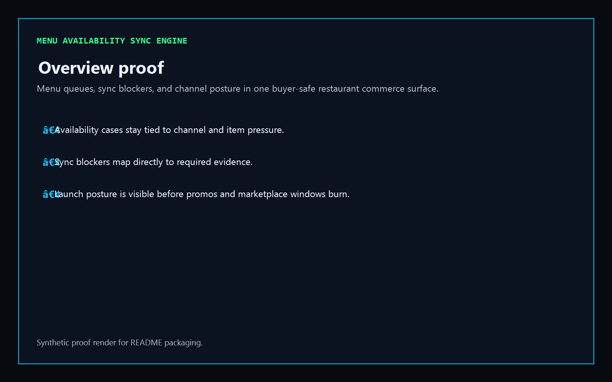
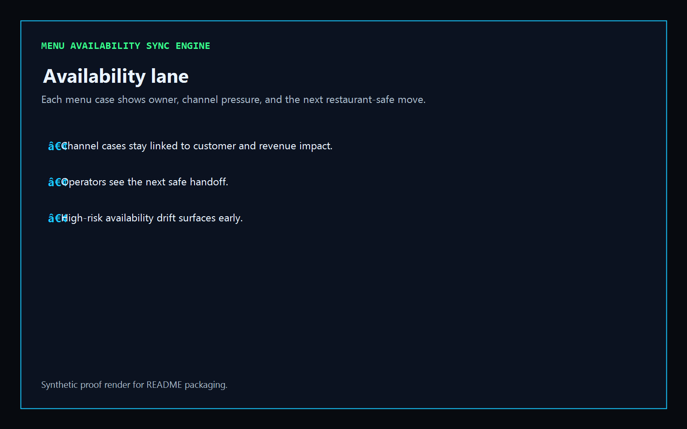
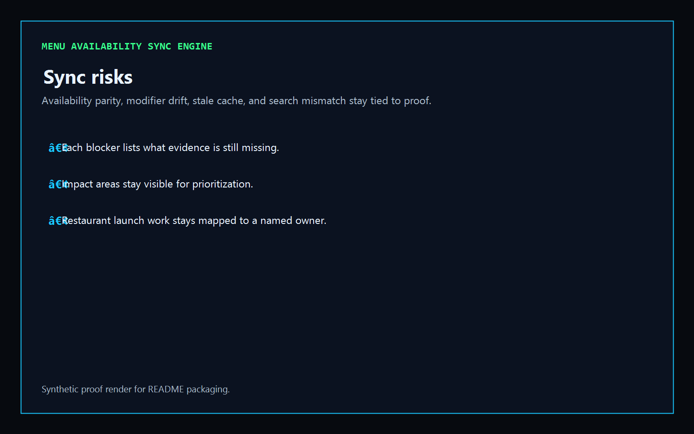
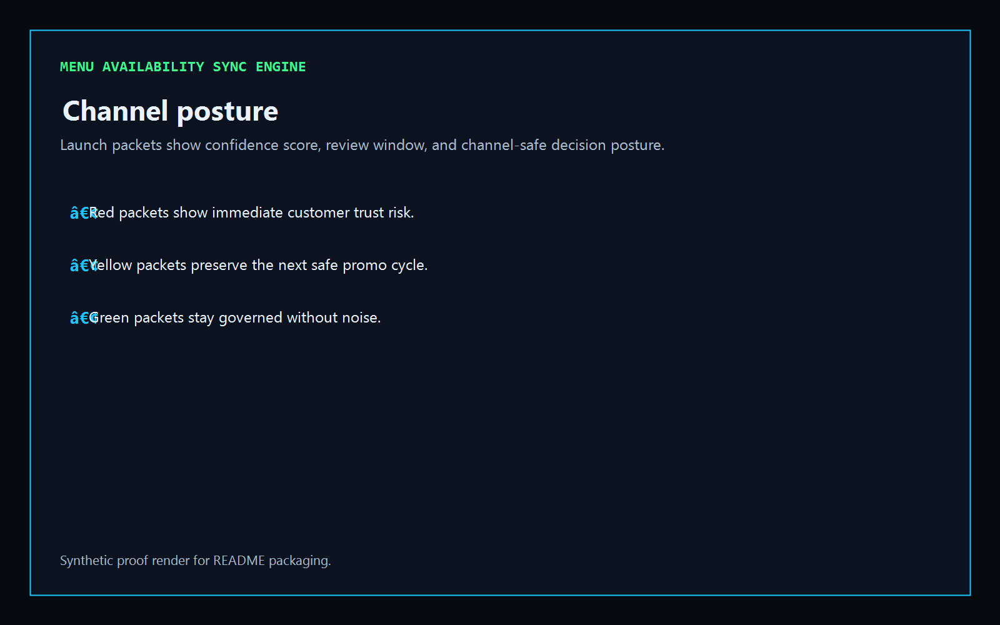

# Menu Availability Sync Engine

[](https://github.com/mizcausevic-dev/menu-availability-sync-engine/actions/workflows/ci.yml)
[](./LICENSE)
[](./.github/dependabot.yml)
[](https://github.com/mizcausevic-dev/menu-availability-sync-engine/actions/workflows/pages.yml)

TypeScript control plane for menu availability, sync blockers, channel posture, and buyer-safe restaurant commerce operations.

## Why this exists

- Restaurant and food-commerce teams lose customer trust when availability events, modifier bundles, cache refreshes, and search-ordering assets drift at different speeds.
- Menu operations need a clear view of which channel cases are active, which sync blockers still need proof, and which packets should not move yet.
- Food / Restaurant Tech buyers care whether menu sync, launch timing, and marketplace posture can stay safe without fragmenting store, growth, and revenue workflows.
- Operators want tooling that turns menu chaos into governed lanes, named ownership, and measurable release posture.

## Why this matters (KG Embedded tie-back)

This repo demonstrates the menu-sync primitive for Food / Restaurant Tech buyers: availability events, channel blockers, and launch-facing posture tied into one operator surface. A B2B SaaS buyer would care because menu, marketplace, and store-state events often need to surface inside customer-facing products without exposing unsafe write paths or fragmented operational evidence. Kinetic Gain Embedded extends this into security-first in-product analytics for menu availability, channel-safe launch cadence, and buyer-readable restaurant commerce workflows, see [kineticgain.com/embedded](https://kineticgain.com/embedded).

## Routes

- `/`
- `/availability-lane`
- `/sync-risks`
- `/channel-posture`
- `/verification`
- `/docs`

## API

- `/api/dashboard/summary`
- `/api/availability-lane`
- `/api/sync-risks`
- `/api/channel-posture`
- `/api/verification`
- `/api/sample`

## Screenshots






## Local Development

```powershell
cd menu-availability-sync-engine
npm install
npm run dev
```

Open:
- [http://127.0.0.1:5572/](http://127.0.0.1:5572/)
- [http://127.0.0.1:5572/availability-lane](http://127.0.0.1:5572/availability-lane)
- [http://127.0.0.1:5572/sync-risks](http://127.0.0.1:5572/sync-risks)
- [http://127.0.0.1:5572/channel-posture](http://127.0.0.1:5572/channel-posture)
- [http://127.0.0.1:5572/verification](http://127.0.0.1:5572/verification)
- [http://127.0.0.1:5572/docs](http://127.0.0.1:5572/docs)

## Validation

- `npm run build`
- `npm run test`
- `npm run coverage`
- `npm run demo`
- `npm run smoke`
- `npm run prerender`
- `npm run render:assets`

## Production status

| Aspect | Status |
|--------|--------|
| CI | Node 20 + 22 matrix - lint, typecheck, coverage, build, demo, smoke, `npm audit` ([workflow](./.github/workflows/ci.yml)) |
| Test coverage | Example coverage gate is wired through Vitest |
| License | [AGPL-3.0-or-later](./LICENSE) |
| Dependencies | Dependabot weekly (npm + GitHub Actions); `npm audit --audit-level=high` in CI |
| Security | [SECURITY.md](./SECURITY.md) |
| Deploy | Static prerender -> [https://menus.kineticgain.com/](https://menus.kineticgain.com/) (GitHub Pages, [pages workflow](./.github/workflows/pages.yml)) |

## Docs

- [Architecture](./docs/architecture.md)
- [Origin](./docs/ORIGIN.md)
- [Kinetic Gain Embedded tie-back](./docs/KINETIC_GAIN_EMBEDDED.md)
- [Changelog](./CHANGELOG.md)

## Part of the Kinetic Gain Suite

Operator surface in the [Kinetic Gain Suite](https://suite.kineticgain.com/) — a portfolio of buyer-readable control planes spanning security posture, compliance evidence, data-platform governance, FinOps, and operator workflows. See the suite index for related surfaces. Apex: [kineticgain.com](https://kineticgain.com/).
